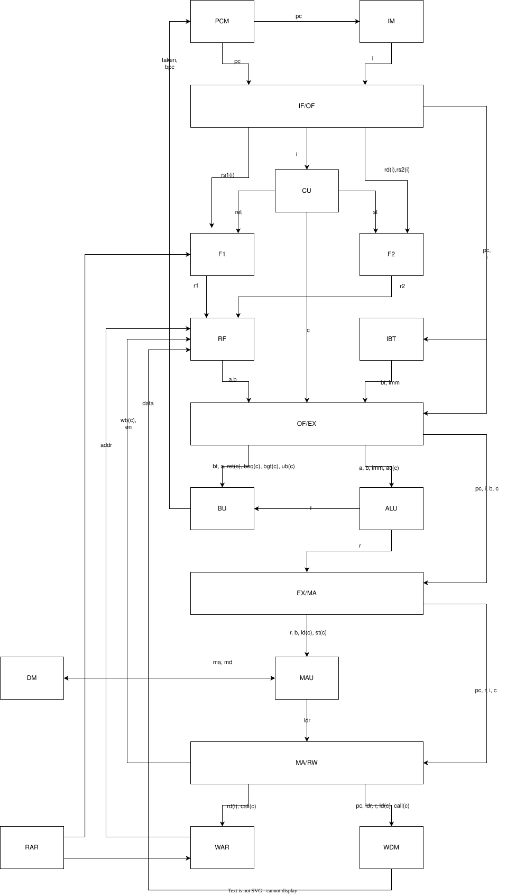

# SimpleRISC — Pipelined SystemVerilog CPU

A from-scratch SystemVerilog implementation of the SimpleRISC processor, implemented as a pipelined CPU and simulated using Icarus Verilog.

The project follows the SimpleRISC architecture and ISA described in:

**Basic Computer Architecture, Version 3.09**  
**Smruti R. Sarangi**  
**October 8, 2025**

---

## Features

- 5-stage pipelined CPU
- SystemVerilog RTL implementation
- 32-bit datapath
- 16 × 32-bit general-purpose registers
- R15 used as the return-address register
- SimpleRISC instruction set:
  - ADD
  - SUB
  - MUL
  - DIV
  - MOD
  - CMP
  - AND
  - OR
  - NOT
  - MOV
  - LSL
  - LSR
  - ASR
  - NOP
  - LD
  - ST
  - BEQ
  - BGT
  - B
  - CALL
  - RET
- Immediate operands
- Immediate U/H modes
- Persistent comparison flags
- Delayed branching
- Separate instruction and data memory
- Word-addressed memory
- Parallel functional units in the EX stage
- Simulation-based verification using Icarus Verilog

---

## Architecture

The processor uses a 5-stage pipeline:

```text
IF → OF → EX → MA → RW
````

where:

- **IF** — Instruction Fetch
- **OF** — Operand Fetch / Decode
- **EX** — Execute
- **MA** — Memory Access
- **RW** — Register Writeback

Pipeline registers:

```text
IF → IFOF → OF → OFEX → EX → EXMA → MA → MARW → RW
```

### Main datapath



---

## Instruction Set

The opcode encoding used by SimpleRISC is:

| Instruction | Opcode  |
| ----------- | ------- |
| ADD         | `00000` |
| SUB         | `00001` |
| MUL         | `00010` |
| DIV         | `00011` |
| MOD         | `00100` |
| CMP         | `00101` |
| AND         | `00110` |
| OR          | `00111` |
| NOT         | `01000` |
| MOV         | `01001` |
| LSL         | `01010` |
| LSR         | `01011` |
| ASR         | `01100` |
| NOP         | `01101` |
| LD          | `01110` |
| ST          | `01111` |
| BEQ         | `10000` |
| BGT         | `10001` |
| B           | `10010` |
| CALL        | `10011` |
| RET         | `10100` |

The complete instruction encoding follows the SimpleRISC specification.

---

## Functional Units

The EX stage contains parallel functional units:

```text
                        ┌────────────┐
first operand ─────►|-->│   Adder    │───┐
                    |   └────────────┘   │
                    |                    │
                    |   ┌────────────┐   │
second operand ────►|-->│ Multiplier │───┤
                    |   └────────────┘   │
                    |                    │
                    |   ┌────────────┐   │
                    |-->│  Divider   │───┤
                    |   └────────────┘   │
                    |                    │
                    |   ┌────────────┐   │
                    |-->│ Shift Unit │───┤
                    |   └────────────┘   │
                    |                    │
                    |   ┌────────────┐   │
                    |-->│Logical Unit│───┤
                    |   └────────────┘   │
                    |                    │
                    |   ┌────────────┐   │
                    |-->│ Move Unit  │───┤
                        └────────────┘   │
                                         ▼
                              ┌────────────┐
                              │ Result MUX │
                              └────────────┘
```

This keeps the functional units structurally separate and selects the required result through multiplexing.

---

## Comparison Flags

`CMP` produces two comparison flags:

- `flags_equal`
- `flags_greater`

These are stored in persistent flag registers.

The flags are updated when a `CMP` instruction reaches the EX stage.

Branch instructions such as `BEQ` and `BGT` consume these persistent flags later.

This is necessary because `CMP` and the corresponding branch are separate instructions moving through the pipeline.

---

## Branching

The processor uses delayed branching.

The instruction immediately following a branch is therefore executed as the branch delay slot.

For example:

```text
B target
instruction_after_branch
target:
...
```

The instruction after `B` is intentionally executed before control transfers to `target`.

### CALL / RET

`CALL` stores the return address in register `R15`.

Because of delayed branching and the word-addressed PC, the return address is:

```text
PC + 2
```

`RET` reads the return address from `R15` and transfers control to it.

---

## Memory

The processor uses separate instruction and data memories.

This allows instruction fetch and data-memory access to occur independently.

The memories are word-addressed.

For the current implementation:

```text
address[9:0]
```

selects a memory word.

The data memory contains 1024 words of 32 bits each.

---

## Immediate Values

The processor supports immediate operands through the SimpleRISC immediate encoding.

The implementation handles:

- normal immediate values
- U-mode immediates
- H-mode immediates
- signed immediate values where specified by the instruction encoding

Immediate values are generated by the immediate/branch-target unit before reaching the EX stage.

---

## Hazards

This implementation does NOT include general hardware hazard detection or forwarding.

Instruction scheduling is therefore expected to respect data dependencies.

The design does NOT use a general-purpose pipeline stall/forwarding mechanism.

The separate instruction and data memories avoid a structural conflict between instruction fetch and data-memory access.

---

## Project Structure

```text
SimpleRISC/
│
├── rtl/
│   ├── CPU.sv
│   ├── program_counter_manager.sv
│   ├── control_unit.sv
│   ├── register_file.sv
│   ├── immediate_branch_target.sv
│   │
│   ├── adder.sv
│   ├── multiplier.sv
│   ├── divider.sv
│   ├── shift_unit.sv
│   ├── logical_unit.sv
│   ├── move_unit.sv
│   ├── ALU.sv
│   │
│   ├── branch_unit_mux.sv
│   ├── memory_access_unit.sv
│   ├── data_memory.sv
│   ├── instruction_memory.sv
│   │
│   ├── IFOF.sv
│   ├── OFEX.sv
│   ├── EXMA.sv
│   └── MARW.sv
│
├── tests/
│   └── ...
│
└── README.md
```

The exact filenames may change as the project evolves.

---

## Simulation

### Requirements

- SystemVerilog-compatible simulator
- Icarus Verilog

### Compile

From the project root:

```bash
iverilog -g2012 -o sim rtl/*.sv tests/<test_file>.sv
```

### Run

```bash
vvp sim
```

---

## Writing a Test Program

Instructions can be loaded directly into the instruction memory from a testbench.

For example:

```systemverilog
dut.instruction_memory.memory[0] = 32'b...;
dut.instruction_memory.memory[1] = 32'b...;
dut.instruction_memory.memory[2] = 32'b...;
```

The CPU can then be allowed to run for a specified number of clock cycles:

```systemverilog
run_cycles(20);
```

Register values can be inspected through the register file:

```systemverilog
dut.register_file.registers[3]
```

Data memory can similarly be inspected:

```systemverilog
dut.data_memory.memory[10]
```

---

## Verification

The processor was developed and tested bottom-up.

Individual components were tested before being integrated into the full CPU.

Tests include:

- multiplexers
- program counter
- control unit
- register file
- immediate generation
- branch target generation
- adder
- multiplier
- divider
- shift unit
- logical unit
- move unit
- ALU
- branch unit
- memory access unit
- pipeline registers
- writeback logic
- complete CPU execution

Instruction-level tests cover:

- arithmetic operations
- multiplication
- division
- modulo
- comparison
- logical operations
- shifts
- MOV
- NOP
- loads and stores
- conditional branches
- unconditional branches
- CALL / RET
- immediate operands

Multi-instruction programs were also tested to verify interaction between pipeline stages and persistent processor state.

---

## Design Philosophy

The project is intended as a hands-on implementation of a processor rather than an attempt to invent a new ISA or microarchitecture.

The SimpleRISC architecture and instruction set provide the specification.

The focus of the project is translating that specification into working RTL and understanding how:

```text
instruction
    ↓
fetch
    ↓
decode
    ↓
operand selection
    ↓
execution
    ↓
memory access
    ↓
writeback
```

becomes an actual clocked hardware implementation.

---

## Current Status

The core SimpleRISC processor is implemented in SystemVerilog and has been tested through individual components and multi-instruction programs.

The current implementation includes:

- 5-stage pipeline
- arithmetic and logical execution
- immediate operands
- memory operations
- persistent comparison flags
- conditional and unconditional branches
- delayed branching
- CALL / RET
- separate instruction/data memory
- register writeback

Further work can include more extensive verification, assertions, waveform-based debugging, hazard handling, and additional architectural features.

---

## Source / Attribution

The SimpleRISC architecture and ISA used in this project are based on:

**Smruti R. Sarangi, *Basic Computer Architecture*, Version 3.09, October 8, 2025.**

The source material is licensed under the:

**Creative Commons Attribution-NoDerivs 4.0 International License (CC BY-ND 4.0)**

Source:

[https://creativecommons.org/licenses/by-nd/4.0/](https://creativecommons.org/licenses/by-nd/4.0/)

The RTL implementation in this repository was written as an independent SystemVerilog implementation of the specified architecture.

---

## Author

**Aarav**

GitHub:

[https://github.com/brave-art-37/SimpleRISC](https://github.com/brave-art-37/SimpleRISC)
