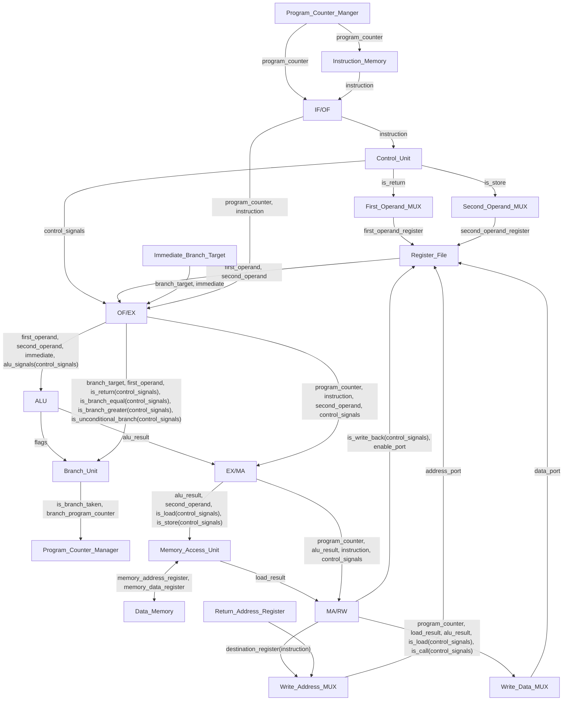

# SimpleRISC architecture

```mermaid
flowchart TB
    %% IF
    Program_Counter_Manger --> |"program_counter"| Instruction_Memory
    Program_Counter_Manger --> |"program_counter"| IF/OF
    Instruction_Memory --> |"instruction"| IF/OF

    %% OF
    IF/OF --> |"instruction"| Control_Unit
    Control_Unit --> |"is_return"| First_Operand_MUX
    Control_Unit --> |"is_store"| Second_Operand_MUX
    First_Operand_MUX --> |"first_operand_register"| Register_File
    Second_Operand_MUX --> |"second_operand_register"| Register_File
    Control_Unit --> |"control_signals"| OF/EX
    Register_File --> |"first_operand, second_operand"| OF/EX
    Immediate_Branch_Target --> |"branch_target, immediate"| OF/EX
    IF/OF --> |"program_counter, instruction"| OF/EX

    %% EX
    OF/EX --> |"first_operand, second_operand, immediate, alu_signals(control_signals)"| ALU
    ALU --> |"alu_result"| EX/MA
    ALU --> |"flags"| Branch_Unit
    OF/EX --> |"branch_target, first_operand, is_return(control_signals), is_branch_equal(control_signals), is_branch_greater(control_signals), is_unconditional_branch(control_signals)"| Branch_Unit
    Branch_Unit --> |"is_branch_taken, branch_program_counter"| Program_Counter_Manager
    OF/EX --> |"program_counter, instruction, second_operand, control_signals"| EX/MA 

    %% MA
    EX/MA --> |"alu_result, second_operand, is_load(control_signals), is_store(control_signals)"| Memory_Access_Unit
    Memory_Access_Unit <--> |"memory_address_register, memory_data_register"| Data_Memory
    Memory_Access_Unit --> |"load_result"| MA/RW
    EX/MA --> |"program_counter, alu_result, instruction, control_signals"| MA/RW

    %% RW
    MA/RW --> |"destination_register(instruction)"| Write_Address_MUX
    Return_Address_Register --> Write_Address_MUX
    Write_Address_MUX --> |"address_port"| Register_File
    MA/RW --> |"program_counter, load_result, alu_result, is_load(control_signals), is_call(control_signals)"| Write_Data_MUX
    Write_Data_MUX --> |"data_port"| Register_File
    MA/RW --> |"is_write_back(control_signals), enable_port"| Register_File
```
