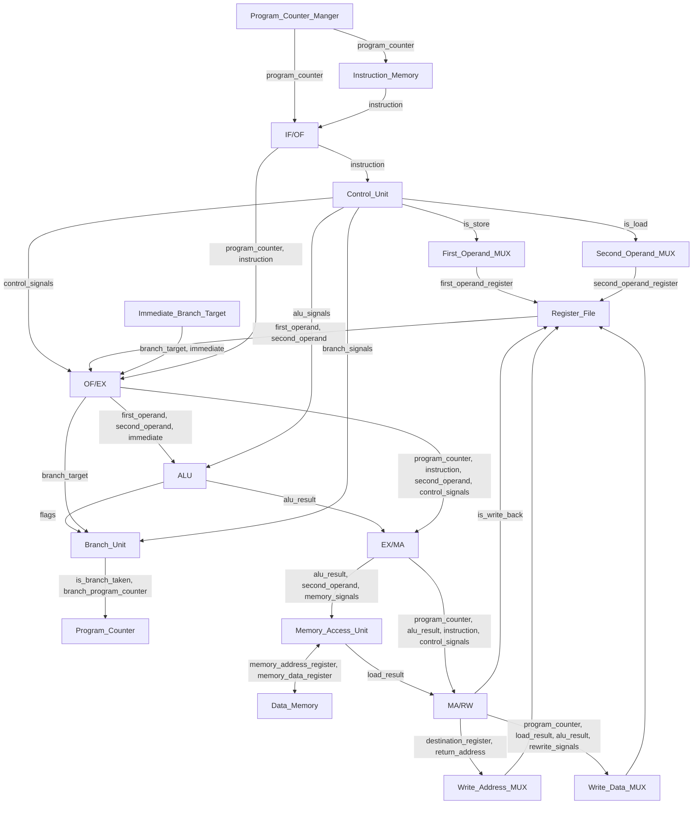

# SimpleRISC architecture

```mermaid
flowchart TB
    %% IF
    Program_Counter_Manger --> |program_counter| Instruction_Memory
    Program_Counter_Manger --> |program_counter| IF/OF
    Instruction_Memory --> |instruction| IF/OF

    %% OF
    IF/OF --> |instruction| Control_Unit
    Control_Unit --> |is_store| First_Operand_MUX
    Control_Unit --> |is_load| Second_Operand_MUX
    First_Operand_MUX --> |first_operand_register| Register_File
    Second_Operand_MUX --> |second_operand_register| Register_File
    Control_Unit --> |control_signals| OF/EX
    Register_File --> |first_operand, second_operand| OF/EX
    Immediate_Branch_Target --> |branch_target, immediate| OF/EX
    IF/OF --> |program_counter, instruction| OF/EX

    %% EX
    OF/EX --> |first_operand, second_operand, immediate| ALU
    Control_Unit --> |alu_signals| ALU
    ALU --> |alu_result| EX/MA
    ALU --> |flags| Branch_Unit
    OF/EX --> |branch_target| Branch_Unit
    Control_Unit --> |branch_signals| Branch_Unit
    Branch_Unit --> |is_branch_taken, branch_program_counter| Program_Counter
    OF/EX --> |program_counter, instruction, second_operand, control_signals| EX/MA 

    %% MA
    EX/MA --> |alu_result, second_operand, memory_signals| Memory_Access_Unit
    Memory_Access_Unit <--> |memory_address_register, memory_data_register| Data_Memory
    Memory_Access_Unit --> |load_result| MA/RW
    EX/MA --> |program_counter, alu_result, instruction, control_signals| MA/RW

    %% RW
    MA/RW --> |destination_register, return_address| Write_Address_MUX
    Write_Address_MUX --> Register_File
    MA/RW --> |program_counter, load_result, alu_result, rewrite_signals| Write_Data_MUX
    Write_Data_MUX --> Register_File
    MA/RW --> |is_write_back| Register_File
```